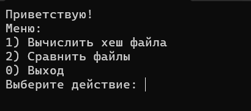
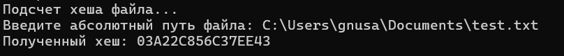
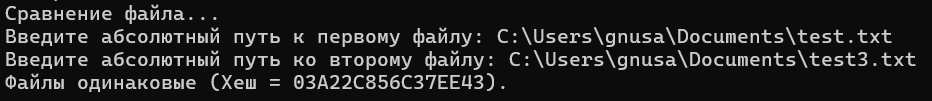
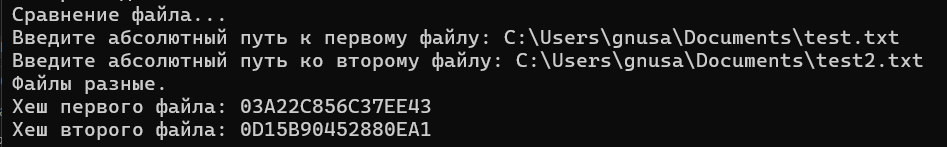

<h1>Курсовая работа на тему "Утилита формирования и сравнения хеша файлов на C"</h2>

<h2>В утилите реализовано две функции:</h4>
<ul>
  <li>Формирование хеша файла</li>
  <li>Сравнение двух файлов по хешу</li>
</ul>

  
При запуске программы открывается компактное меню:

  

  На выбор даны три варинта: 1 - формирование хеша, 2 - сравнение файлов, 0 - выход.
  При выбора выхода программа завершается.

  <h3>Формирование хеша</h4>
  
При выборе формирование хеша нужна будет ввести абсолютный путь до файла, у которого будет вычисляться хеш (необходимо указывать путь со всеми пробелами и знаками, как он есть. Не выделять путь в скобки!!!). 
  После ввода пути и нажатия клавиши Enter на экран будет выведен полученный хеш.

  

  <h3>Сравнение двух файлов.</h4>
  

    При выборе сравнения файлов необходимо будет ввести два абсолютных путей до файлов, которые надо сравнить.
    После этого будет выведен рузультат сравнения. 
    Файлы равны:
  

  
  
Файлы не равны:

    

